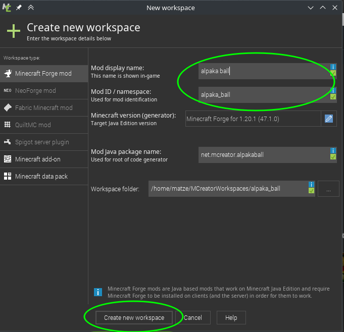

# Vorbereitung: Neues Projekt in MCreator anlegen

Öffne im ersten Schritt MCreator. Unter allen Betriebssystemen (Windows, macOS und Linux) ist MCreator eine normale Anwendung und kann wie jede andere gestartet werden.

Als erstes erstellst du jetzt ein neues Projekt:

Folgende Felder füllst du nun aus:
- **Mod-Anzeigename** - wie soll deine Mod heißen? 
- **Mod-ID** - Interner Name (muss ohne Leerzeichen etc. sein)
- **Minecraft-Version** - Mods müssen passend zur Minecraft Version sein - hier wählst du bitte für dieses Tutorial "Minecraft Forge for 1.19.2"

Klicke dann auf "Neue Arbeitsumgebung erstellen" - es öffnet sich eine Internetseite die um eine Spende bittet.

Der Download und erste Build dauert je nach Internet und Computer ein bisschen. Dadurch wird uns aber viel Arbeit abgenommen die wir sonst von Hand machen müssten, also warten wir gerne :)

{}  
Manchmal wartet man ewig und es war eigentlich schon fertig. Wenn man in der Konsole eine erfolgsnachricht sieht, und nichts mehr passiert, kann es sein, dass man das Popup fenster schließen kann und trotzdem alles fertig installiert ist.  
{}

## Übersicht über die IDE

{}
[IDE](https://de.wikipedia.org/wiki/Integrierte_Entwicklungsumgebung) steht für Integrated Development Editor oder Integrierte Entwicklungsumgebung. Das ist ein Programm, dass alle nötigen Tools zum Programmieren zusammenfasst - unsere Arbeitsumgebung für dieses Tutorial. 

{}

Hier siehst du die Startseite der IDE und alle wichtigen Elemente:

1. Mit dem + kann man neue Elemente erstellen, z.B. Blöcke, Tiere, Gegenstände ...
2. In dieser Leiste sieht man welche Elemente gerade zur Bearbeitung geöffnet sind.
3. In dem großen (noch leeren) Bereich sieht man dann eine Übersicht über alle erstellten Elemente.
4. Hier sind mehrere kleine Knöpfe wichtig:  
    sind manche Symbole ausgegraut, können diese aktuell nicht geklickt werden.
    - das grüne Dreieck: startet Minecraft mit der neu erstellten Mod
    - das rote Viereck: stoppt was gerade läuft, also z.B. wenn man Minecraft noch gestartet hat
    - die orangene Datei mit dem Pfeil: exportiert die Mod zur Verwendung mit anderen Mod-Launchern.  
5. Hier kann man Variablen erstellen

{}
Wenn man in Minecraft länger an etwas baut, dann hilft es ein paar Einstellungen vorzunehmen. Dazu gibt es Befehle in Minecraft. Um einen Befehl einzugeben öffne im Spiel mit `T` den Chat und tippe ein `/` und danach den Befehl ein.

- Zeit auf Tag setzen und auf Tag lassen  
`/time set day` & `/gamerule doDaylightCycle false`
- Wetter auf schön setzen und Wetter so lassen
`/weather clear` & `/gamerule doWeatherCycle false`

{}

{}  
Es gibt noch sehr viel weitere praktische `gamerule`s: [Minecraft Wiki Gamerules](https://minecraft.fandom.com/wiki/Game_rule)  
{}