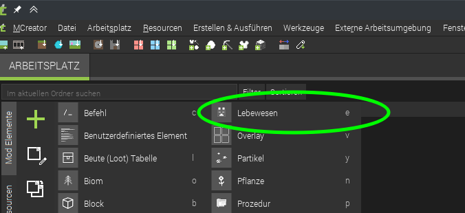
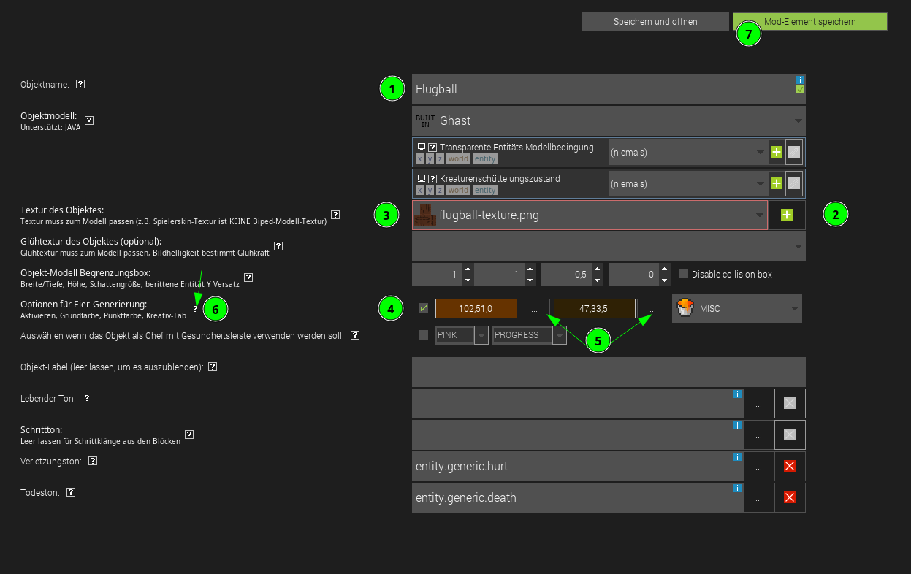

# Ball erstellen
Wenn wir das Projekt erstellt haben können wir mit dem + neue Objekte hinzufügen, und auswählen, welche Art von Objekt wir erstellen möchten:

Natürlich müssen wir einen Namen vergeben:

Bei der Bearbeitung von einem Objekt gibt es verschiedene Kategorien (in der Unteren Leiste auswählbar).
Bei *Bild und Ton* ist folgendes wichtig für unseren Ball:

1. Name wird übernommen aus vorigem Dialog
2. Textur muss hinzugefügt werden mit dem Plus  
als Textur kann z.B. diese hier verwendet werden  
  
muss bei dem Textur-Auswahl-Dialog importiert werden 
TODO?: genauer erklären?
3. erst danach können wir die Textur im Dropdown auswählen
4. wir lassen uns auch ein Spawn-Ei generieren
5. für das Ei können wir bei den 3 Punkten neben dem Farbfeld die Farben auswählen die das Ei haben soll.
6. zu jedem attribut das man hier auswählen kann gibt es bei dem fragezeichen einen Hilfetext
7. Speichern nicht vergessen.

Nach dem speichern dauerts eine kleine Weile, bis MCreator die Mod daraus erstellt hat, wenn dann das Play-Dreieck oben rechts grün ist kann man mit dem Play-Dreieck dann Minecraft direkt mit der neuen Mod starten.

Wie gewohnt in minecraft eine Welt iim Kreativmodus erstellen
TODO?: anleitung dafür nötig?

Das erstellte Spawn-Ei versteckt sich im Kreativ Inventar:

1. Verschiedenes Tab
2. ganz nach unten scrollen
3. tadaaa! :)

  
So siehts bis jetzt aus:

- der Ball fällt und fliegt noch nicht
- der Ball läuft selbst noch herum
- Ball kann noch sterben werden wenn man ihn schlägt :(



## Verhalten bearbeiten:
Mit Doppelcklick auf ein Element kann dieses wieder bearbeitet werden:

erst unten auf den Verhaltens-Reiter wechseln:
dann gibts die Werte zu ändern.
- *creature* damit der Ball nich angreift
- *bewegungsgeschwindigkeit* = 0, damit er uns nicht von alleine weg fliegt
- unser Ball soll nicht sterben wenn man ihn schlägt
    - *Gesundheitswert* = 1024 (höchst möglicher wert, (2er potenz ;)) 
    - *Rüstungsschutz* = 100 (auch höchst möglicher wert)

  
So siehts bis jetzt aus:

- der Ball fällt nicht mehr, sondern fliegt
- der Ball läuft nicht mehr herum
- Ball stirbt nicht mehr ;)
- macht jetzt schon Spaß den Ball mit Schlag oder Rückstoß verzauberten Schwert und Bogen zu schubsen ;D


