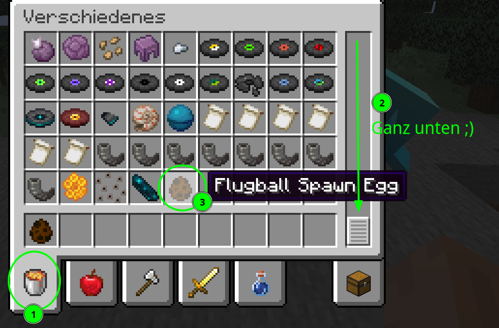

# Unser Spiel: Haecksen-Ball

Aber was machen wir hier eigentlich? Mit Mods lässt sich Minecraft ja individuell erweitern. Da Minecraft ja vom Prinzig "Spiel im Spiel" lebt - also, dass man eigene Spiele in Minecraft spielt, die nichts mit dem ursprünglichen Prinzip zu tun haben. Gute Beispiele sind zum Beispiel Bedwars oder Builder-Challange.

Wir haben uns für unsere Spiel-Idee an dem Sport [Quidditch](https://de.wikipedia.org/wiki/Quidditch_(Sport)) orientiert, der ja von Zauberern und Hexen gespielt wird. Um das ganze noch perfekt in den Hacker-Kontext einzubetten, haben wir es (Haeckses-)[https://de.wikipedia.org/wiki/Haeckse]Ball gennant: eine Haeckse ist ein weiblicher Hacker :)

# Den Ball für unser Spiel erstellen 

Als erstes brauchen wir einen passenden Ball, er ist das Zentrum unseres Spiels.
Es gibt in Minecraft ja viel verschiedene "Sachen" - Blöcke, Pflanzen, Mobs. Für den Ball haben wir uns für ....

Du kannst neue Objekte über das "+" Plus Zeichen hinzufügen. Wähle dann "Lebewesen" aus:

Lebewesen sind "Entities", die sich bewegen konnen - anhand von Regeln und KI, die Du festlegen kannst - das passt doch perfekt!

Natürlich musst Du einen Namen vergeben:

Jetzt öffnen sich das Fenster, in dem Du alle Eigenschaften des neue erstellten Lebewesens festlegen kannst. 
Bei der Bearbeitung von einem Objekt gibt es verschiedene Kategorien (in der Unteren Leiste auswählbar).

Bei *Bild und Ton* ist folgendes wichtig für unseren Ball:

1. Name wird übernommen aus vorigem Dialog
2. Die Textur bestimmt das Aussehen Deines Balls - Du fügst die Textur mit dem **+ Plus** hinzu. Du kannst selbst eine Textur erstellen oder diese als Beispiel benutzen:   
3. Erst danach kannst Du die Textur im Dropdown auswählen
4. Wir lassen uns auch ein Spawn-Ei generieren
5. Für das Ei können wir bei den 3 Punkten neben dem Farbfeld die Farben auswählen die das Ei haben soll.
6. Zu jedem attribut das man hier auswählen kann gibt es bei dem fragezeichen einen Hilfetext
7. Speichern nicht vergessen!

Nach dem speichern dauert es eine kleine Weile, bis MCreator die Mod daraus erstellt hat, wenn dann das Play-Dreieck oben rechts grün ist kann man mit dem Play-Dreieck dann Minecraft direkt mit der neuen Mod starten:


Da passiert ganz viel im Hintergrund - unter **Konsole** kannst Du Dir anschauen, was MCreator alles machen muss, um die Mod zu kompilieren.


Wenn Minecraft gestartet ist, erstelle eine Welt im [Kreativ-Modus](https://minecraft.fandom.com/de/wiki/Kreativmodus) - damit hast Du direkt Zugriff auf alle Gegenstände und kannst den Ball am einfachsten testen.

Das erstellte Spawn-Ei versteckt sich im Kreativ Inventar:

1. Wähle den Tab **"Verschiedenes"**
2. ganz nach unten scrollen
3. tadaaa! :)

  
So siehts bis jetzt aus:

- der Ball fällt und fliegt noch nicht
- der Ball läuft selbst noch herum
- Ball kann noch sterben werden wenn man ihn schlägt :(



## Verhalten bearbeiten:
Jetzt wollen wir aber dem Ball noch beibringen, dass er sich wie ein Ball verhalten soll. Schließe Minecraft und gehe dazu wieder in MCreater.Mit Doppelcklick auf ein Element kann dieses wieder bearbeitet werden:

Um das Verhalten zu verändern, wechselst Du unten auf den Verhaltens-Reiter. Jetzt kanst Du die Werte ändern:

- **creature** damit der Ball nich angreift
- **bewegungsgeschwindigkeit** = 0, damit er uns nicht von alleine weg fliegt
- unser Ball soll nicht sterben wenn man ihn schlägt
    - **Gesundheitswert** = 1024 (höchst möglicher wert, (2er potenz ;)) 
    - **Rüstungsschutz** = 100 (auch höchst möglicher wert)

  

Das hast Du schon geschafft: 

- der Ball fällt nicht mehr, sondern fliegt
- der Ball läuft nicht mehr herum
- Ball stirbt nicht mehr ;)
- macht jetzt schon Spaß den Ball mit Schlag oder Rückstoß verzauberten Schwert und Bogen zu schubsen ;D


