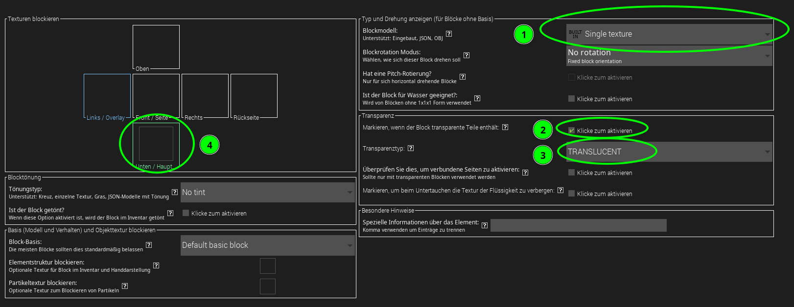
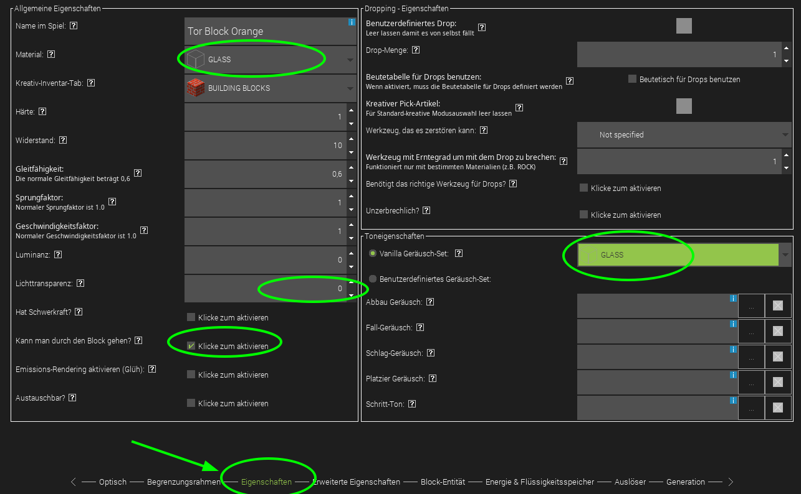
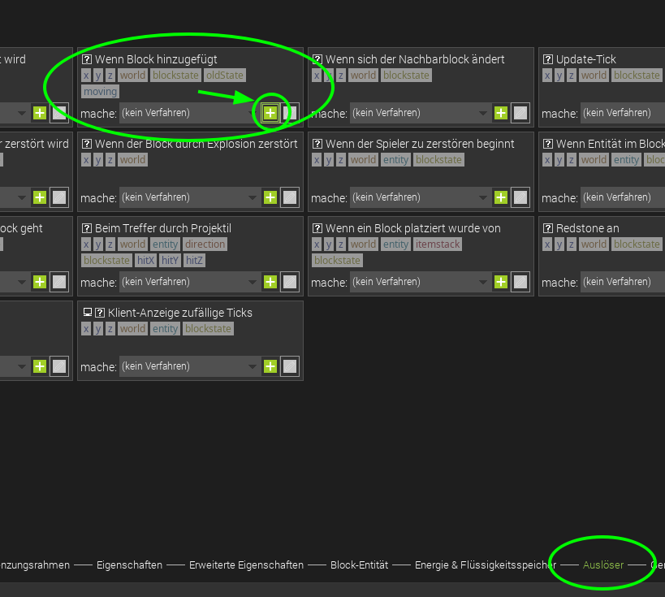

# Level 2: Tor! Oder: Da muss der Ball rein

Unser Tor soll aus Blöcken gebaut werden können: In diesem Level erstellst du also einen eigenen Block, mit dem dann das Tor im Spiel gebaut werden kann.

Jetzt kannst du die Eigenschaften des Blocks anpassen - das kennst du schon aus unserem ersten Level, dort haben wir die Eigenschaften des "Lebewesens" Balls angepasst.

1. Wähle hier aus, dass auf allen Seiten die gleiche Textur verwendet werden soll, das spart viel Arbeit.
2. Die Beispieltextur (Schritt 4) ist halbtransparent, deshalb wähle hier aus, dass der Block transparente Teile enthält.
3. Setze den Transparenztyp auf `Translucent`.

4. Hier kannst du die Textur für den Block importieren und auswählen. Als Beispieltextur für das Tor kannst du diese Vorlage verwenden:
   
   [Gimp-Projekt "Tor_block_rahmen"](tor_block_rahmen.xcf)
   [Von GitHub herunterladen](https://raw.githubusercontent.com/KidsLabDe/alpaka_ball_oer/main/03-tor-erstellen/tor_block_rahmen.xcf)
   Natürlich kannst du auch selbst kreativ werden und deine eigene Textur erstellen!

Gib dem Block jetzt glasähnliche Eigenschaften:

Wir haben verschiedene Möglichkeiten getestet und uns entschieden, den Block so zu konfigurieren, dass man durch ihn hindurchlaufen kann.

{}
Beim Programmieren ist es immer gut, zwischendurch immer mal wieder zu testen und auszuprobieren. Jetzt ist ein guter Zeitpunkt: Drücke den grünen Play-Knopf (rechts oben) und teste das Ganze!
{}

## Anzeige des Spielstandes - Wie viele Tore wurden geschossen?

Wie könnten wir jetzt die erzielten Tore anzeigen? Wir haben uns an die Boss-Bar erinnert: In Minecraft Vanilla (ohne Mods) kann man mit bordeigenen Mitteln eine Bossbar hinzufügen.

Dafür gibt es diese Befehle:

1. Neue Bossbar erstellen

   `/bossbar add orange {"text":"Team Orange"}`

2. Farbe festlegen

   `/bossbar set orange color yellow`

3. Maximalwert der BossBar (12 bedeutet, wer 12 Tore hat, hat gewonnen)

   `/bossbar set orange max 12`

4. Stil auswählen (schön, passend zum Maximalwert)

   `/bossbar set orange style notched_12`

5. ... und jetzt noch anzeigen:

   `/bossbar set orange players @a`

{}
Öffne Minecraft (am einfachsten wieder über MCreator, grüner Knopf...) und starte eine Kreativ-Welt. Öffne mit `T` die Chat-Zeile. Gib die Befehle wie oben nacheinander in dieser Zeile ein und bestätige jeden mit Enter. Klappt es? Dann solltest du jetzt eine Boss-Bar sehen!
{}

## Wie werden die Tore gezählt? Auslöser!

Jetzt muss das Tor ja wissen, dass ein Ball reinflog. Wie könnten wir das am besten anstellen? **Auslöser** bieten die Möglichkeit, auf gewisse Ereignisse in Minecraft zu reagieren und unseren Code auszuführen, z.B. wenn ein Block gesetzt wird. Gehe noch mal in die Eigenschaften des Tor-Blocks und wähle unten "Auslöser" aus. Jetzt schreibst du deinen ersten Code für die Mod: Wähle im Bereich **Wenn Block hinzugefügt** aus, dass du eine neue Prozedur erstellen möchtest - wie gewohnt mit dem **+ Plus**-Knopf.

Wir erstellen also eine Prozedur, ein Stück Code, das ausgeführt werden soll, wenn der Block eine Entität (Entity) berührt:

Der Name der Prozedur wird automatisch generiert (den kannst du so lassen). Jetzt sollten die 4 Minecraft-Befehle von oben ausgeführt werden, wenn das Tor gebaut wird. Also suchen wir den Baustein, der uns ermöglicht, einen Minecraft-Befehl auszuführen.

- Wähle links die Kategorie *Welt Management*.
- Nimm den Programmier-Block ganz oben: `Führe Befehl ... aus ...`
- Ziehe ihn in die Programmier-Oberfläche und docke ihn unter dem Event-Auslöser an.
- Füge jeweils in den Anführungszeichen die Befehle von oben ein.

So sieht es aus, wenn die Befehle von oben alle ausgeführt werden sollen:

Vergiss nicht zu speichern, indem du rechts oben auf **Mod-Element speichern** klickst.

Gerne mal testen. Falls du es nochmal testen möchtest, kannst du die Bossbar mit `/bossbar remove orange` wieder entfernen vor dem neuen Test.

{}
Jetzt sollte es so aussehen, nachdem du einen orangenen Torblock gesetzt hast:

{}

## Was ist mit der gegnerischen Mannschaft?

Jetzt natürlich das Ganze noch für das zweite Team: Team Blau. Weil wir nicht alles nochmal neu machen wollen, können wir die bestehenden Elemente kopieren:

Du musst jetzt einen neuen Namen vergeben, z.B. *TorBlockBlue*.

Erstelle jetzt - wie vorher beim ersten Block - einen neuen Auslöser und eine neue Prozedur:

- Rechtsklick
- *Mod-Element duplizieren*
- Neuer Name: *TorBlockBlueWennBlockHinzugefügt*

Und in beiden Elementen musst du die IDs und farbrelevanten Eigenschaften anpassen:

- Tausche die Blocktextur aus.
- In der Kategorie *Eigenschaften* von dem Block solltest du noch den Namen von *Tor Block Orange* auf *Tor Block Blau* ändern.
- Und natürlich den Auslöser auch anpassen, damit die Funktion für die blaue Bossbar aufgerufen wird:

- Tausche den Code für die Farbe aus: *orange* war hier die ID der Bossbar und *yellow* war die Farbe. Beides kann zu *blue* geändert werden.

{}
Wow - du hast schon eine Menge geschafft: Bälle gibt's, Tore - und sogar die Tor-Anzeige!

{}
