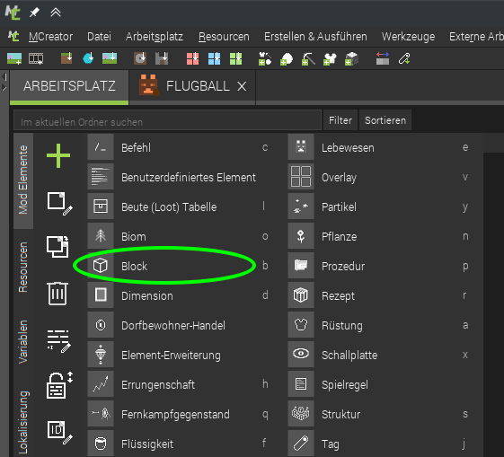
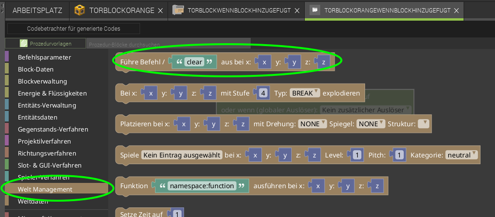
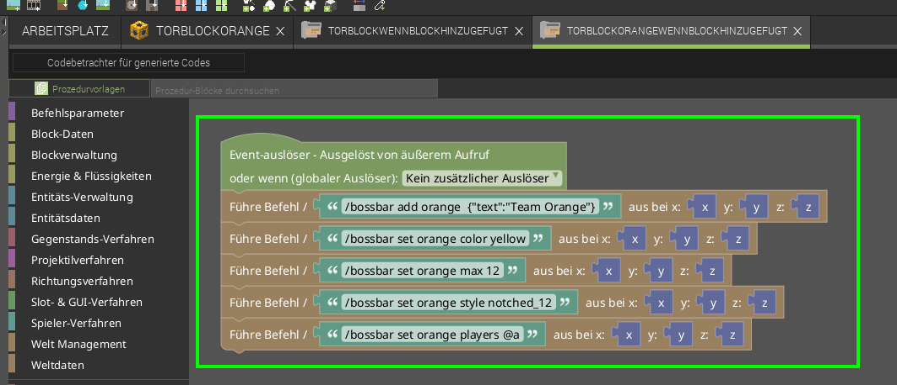

# Tor erstellen
Unser Tor soll aus Blöcken gebaut werden können, desshalb erstellen wir einen Block:

Block Eigenschaften vergeben:

1. wählen wir aus, dass auf allen Seiten die gleiche Textur verwendet werden soll, das spart uns Arbeit ;)

die Beispieltextur (schritt 4) ist halb transparent, desshalb:

2. wählen wir hier aus, dass die der Block transparente Teile enthällt
3. und den Transparenztyp *Translucent*

4. Hier kann die textur importiert und für den Block ausgewählt werden
   als Beispieltextur für das Tor könnt ihr das verwenden:  
   [Gimp-Projekt "Tor_block_rahmen"](tor_block_rahmen.xcf)
     

Als nächstes schlag ich vor wir geben dem Block glasähnliche eigenschaften:

Ich habe hier auch ausgewählt, dass man durch den Block durch laufen kann.

Zu dem Zeitpunkt kannst du dir gerne mal anschauen wies aktuell in Minecraft aussieht

## Tor Anzeige
Jetzt wollen wir natürlich noch eine Anzeige für die Tore hinzufügen:  
Die Minecraft Vanilla (also ohne Mods) Befehle, die eine Bossbar hinzufügen:
1. bossbar erstellen  
   `/bossbar add orange  {"text":"Team Orange"}`
2. farbe festlegen  
   `/bossbar set orange color yellow`
3. Maximalwert festlegen  
   `/bossbar set orange max 12`
4. Stiel auswählen (schön, passend zum Max-wert)  
   `/bossbar set orange style notched_12`
5. dann für alle sichtbar machen  
   `/bossbar set orange players @a`

# Auslöser
Auslöser bieten uns die Möglichkeit auf gewissse Ereignisse in Minecraft zu reagieren und useren Code auszuführen, z.B. wenn ein Block gesetzt wird.
Wir erstellen also eine Prozedur, eine stück Code, das ausgeführt werden soll, wenn der Block eine Entität (Entity) berührt:

- Wieder namen vergeben, automatisch generierter Name passt.

Wir wollen 4 Minecraftbefehle ausführen, also suchen wir den Baustein, der uns ermöglicht einen Minecraftbefehl auszuführen:

- Links in den Kategorien bei *Welt Management* 
- ganz oben *Führe Befehl ... aus ..."
- hier setzen wir jetzt die ganzen Befehle von oben ein

So sieht das dann aus wenn die Befehle von oben alle ausgeführt werden sollen:

speichern nicht vergessen ;)

Gerne mal testen. Falls du es nochmal testen willst kannst du die Bossbar mit  
`/bossbar remove orange`  
wieder entfernen vor dem neuen test.

  
Jetzt sollte es so aussehen nachdem man einen orangenen Torblock gesetzt hat:

  


## 2tes team
Jetzt natürlich noch für n zweites Team. Team Blau.
Weil wir nicht alles nochmal neu machen wollen können wir die bestehenden Elemente kopieren:

Name vergeben, z.B. *TorBlockBlue*   

Das selbe mit dem *TorBlockOrangeWennBlockHinzugefügt*
- Rechtsklick
- *Mod-Element duplizieren*
- Neuer Name *TorBlockBlueWennBlockHinzugefügt*

Und in beiden Elementen müssen wir die IDs und Farbrelevanten eigenschaften anpassen:

- Blocktextur austauschen
- In der Kategorie *Eigenschaften* von dem Block sollte noch der Name von *Tor Block Orange* auf *Tor Block Blau* ändern.
- Und natürlich den Auslöser auch anpassen, dass die Funktion für die blaue Bossbar aufgerufen wird:

- code farbe austauschen  
  *orange* hier war die ID der Bossbar und *yellow* war die Farbe  
  kann beides zu *blue* geänder werden

  
Und so siehts bis jetzt aus:
  

