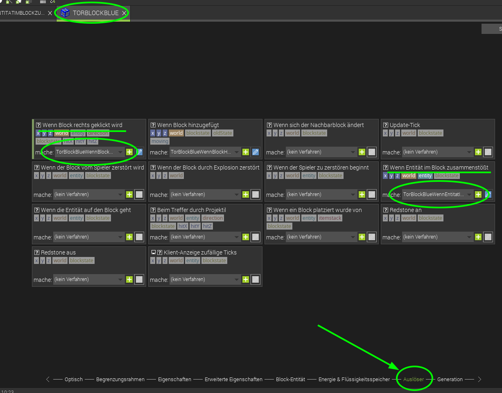
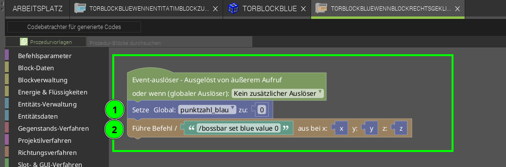
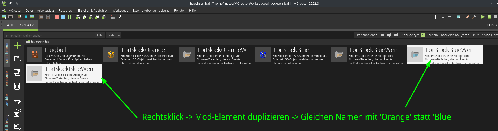
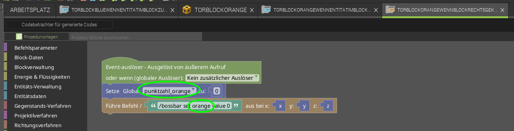
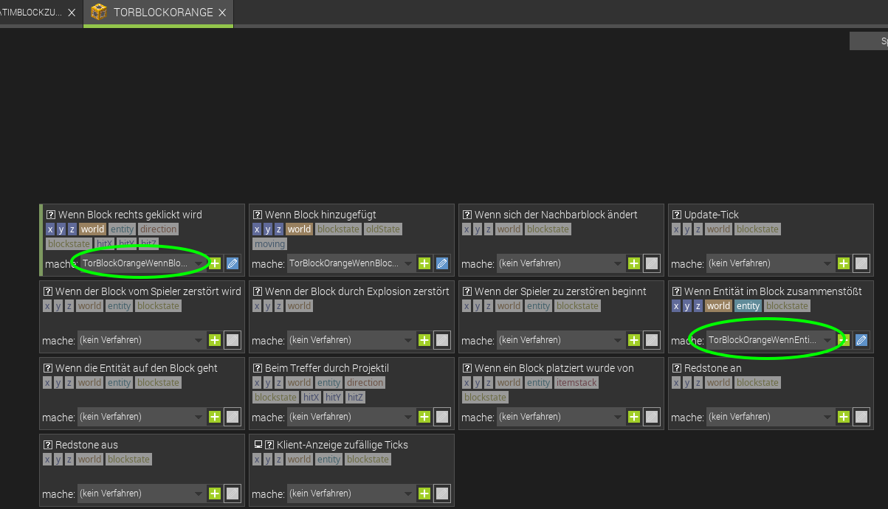

# Level 3: Tore / Punkte zählen

So, wir haben Tore, einen Ball - aber aktuell werden die Tore noch nicht gezählt. Das packen wir in diesem Level an!



Was ist denn genau eine Variable? Variabel hört sich ja an wie „variabel“, also veränderbar. Am besten kannst Du dir eine Variable einen dieser Klebezettel vorstellen. Die sind super, um sich Sachen zu merken!

**Hintergrund: Variablen-Typen**

Es gibt verschiedene Arten von Variablen, ja nach dem, was man sagen will:

- Ja / Nein – Boolean
- Text – String
- Einfache Zahlen (1,2,3…) – Integer
- Komma-Zahlen (3,1415) – Float

Und nach ganz viele mehr…

**Achtung: Gute Namen sind gute Helfer**

Variablen-Namen können nur aus einem Buchstaben, aber auch ganzen Wörtern bestehen. Wähle den also weise: gib den Variablen Namen, die andere (und auch Du noch 2 Wochen ;-)) noch verstehen. Dann findest Du Dich viel leichter im eigenen Programm zurecht. 

 

## Punkte merken

Wir erstellen also eine Variable - in der merken wir uns jeweils die Tore / Punkte pro Team

Dazu erstellen wir eine variable für jedes team:

1. In der seitlichen Leiste *Variablen* auswählen
2. Eine *Neue Variable hinzufügen*
3. *Variablenname* vergeben und typ *Variablentyp* auf *number* setzen
4. mit *Ok* speichern
5. ...das gleiche nochmal für die andere Farbe

## Tore erkennen

Jetzt müssen wir nur noch erkennen, wenn ein Tor geschossen wurde. Genau - da gabs ja was - die "Auslöser". Wir suchen also einen Auslöser, der erkennt, wenn ein Tor geschossen wurde.

  

Wir fügen 2 Auslöser hinzu:

- einen *Wenn Block rechts geklickt wird*  
  um Punkte zurück zu setzen.
- einen *Wenn Entität im Block zusammenstößt*  
  um Punkte hoch zu zählen und Ball zu entfernen

### Prozedur 1: Punkte zurücksetzen 

In diesem Fall möchten wir, dass die Punkte des Teams auf "0" gesetzt werden - und, dass die Bossbar auch zurückgesetzt wird. Dafür verwenden wir folgende Befehle:

1. Setzt die globale variable zum Punkte Zählen auf 0 zurück
2. führt `/bossbar set blue value 0` in Minecraft aus um die Bossbar wieder auf 0 zu setzen.

### Prozedur 2: Tore zählen  

Um die Tore zu zählen, haben wir einen Auslöser erstellt, der immer wenn er vom Ball berührt wird, startet.

Die Prozedur für den Zusammenstoß mit einem Entity ist länger und sieht so aus:

1. Tore sollen nur bei Ball-Kontakt gezählt werden: als erstes prüft das Programm, ob es sich bei der Entität um einen Ball handelt
2. Dazu "holen" wir uns den Anzeige-Namen der "Berührenden Entity" mit `Erhalte den Anzeige-Namen von Event/target entity` und prüfen ob der gleich dem String `Flugball` ist. (Muss übereinstimmen, wie der Objektname bei [Bild und Ton von *Ball erstellen*](../02-ball-erstellen/ball-erstellen.md))
3. Diese beiden Zeilen, die vom Hauptcodeblock abgelösten sind, werden nicht ausgeführt. Sie sind nur ein Hinweis, was ich probiert hab: bei der (3) wollt ich auf diese 2 Wege testen ob es sich um einen Ball handelt, was leider nicht geklappt hat.
4. Erhöht die Punktzahl von Blau: 
5. - dazu holt es sich die aktuelle `punktzahl_blau` 
    - und fügt mit *+* 
    - die Zahl *1* hinzu 
    - und Speichert das Ergebnis mit `Setze Global: punktzahl` zu wieder in der Punktezahl für blau ab.
6. Wir führen den Minecraft Befehl für die Bossbar aus - den kennst Du ja schon aus Level 3.
7. Dazu kombinieren wir den text `/bossbar set blue value ` **(!Achtung! Leerzeichen am Ende wichtig, dass es funktioniert)** mit der `punktzahl_blau` und runden diese, weil es sich sonst um eine Kommazahl handelt. (zwar immer ,0 aber Minecraft kennt hier keine Kommazahl, desshalb machen wir die so weg)
8. wir geben dem Spieler, der am nächsten steht (`@p`) ein neues Spawn-Ei  
    `/give @p haecksen_ball:flugball_spawn_egg`
9. Wenn ein Tor fällt, muss man das natürlich auch hören: mit diesem Befehl können wir einen Ton abspielen lassen, wenn ein Tor geschossen wurde. Hier z.B. der gleiche Ton, wenn man XP aufsammelt: *entity.experience_orb.pickup*
10. Am Schluss wollen wir den Ball natürlich "los werden" - er soll verschwinden und mit einem neuen Ball geht es weiter.  
    - dazu am besten den Befehl `Zerstöre` verwenden
    - Achtung: die Minecraft befehle `kill @e[...]`, `tp @e[...] ~ -500 ~` und MCreator `Lösche` gehen nicht aus verschiedenen Gründen.
11. **Speichern nicht vergessen ;)**


Vielleicht wunderst Du Dich, warum wir jetzt dem blauen Team einen Punkt geben, wenn ein Ball ins blaue Tor geht - müsste ja eigentlich anders rum sein oder? So dachten wir, es es einfacher - wenn man mit 2 Teams spielt, geht es ja noch. Aber man kann das ganze ja auch für 3 oder mehr Teams programmieren, dann geht es nicht mehr so einfach. Mit 12 Punkten hat man also verloren...

 

  
Wenn ihr wollt könnt ihr am Anfang auch 12 Punkte vergeben und mit jedem Tor in den blauen Torblock 1 Punkt von Blau abziehen.
Spielt gerne mit den Zahlen rum ;)  
  

  
Jetzt kann's im Spiel getestet werden, und wenn ein Ball in einen blauen Torblock fliegt, dann sollte ein Ton kommen, die Punktzahl in der Bossbar erhöht werden, der Ball verschwinden und man bekommt ein neues Spawn-Ei.  


### Jetzt nochmal für Orange
Die Variable `punktezahl_orange` für Orange haben wir ja schon erstellt - jetzt fehlen nur noch die passenden Prozeduren, die können wir erst mal kopieren vom Team Blau.

- Gehe zum **Arbeitsplatz**
- Rechts auf die Prozedur klicken - wähle **Mod-Elemnt duplizieren**
- Nenne die neuen Prozeduren ...Orange... statt ...Blau...

Jetzt natürlich noch alle dinge von Blau zu Orange ändern in den beiden Codedateien:

  
Und nochmal testen ;)

Wenn was nicht klappt, schau oben Schritt für Schritt alles durch, ob Du was vergessen hast.

