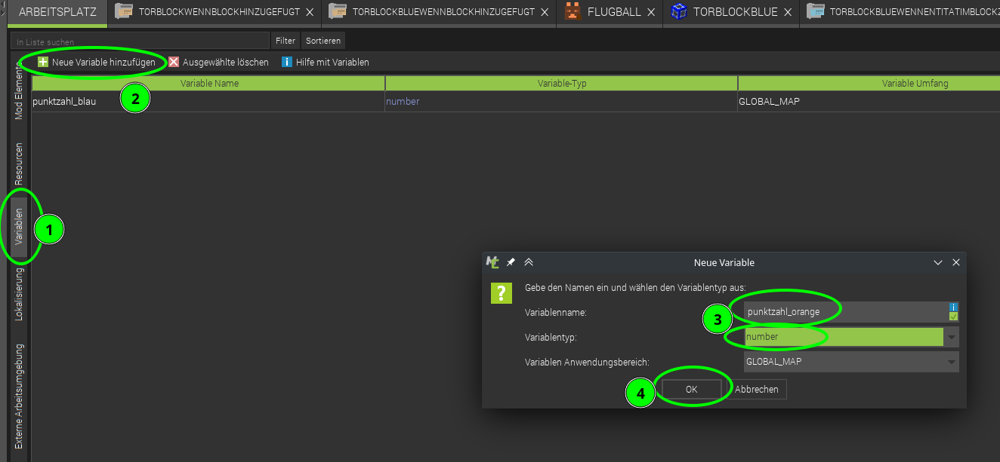
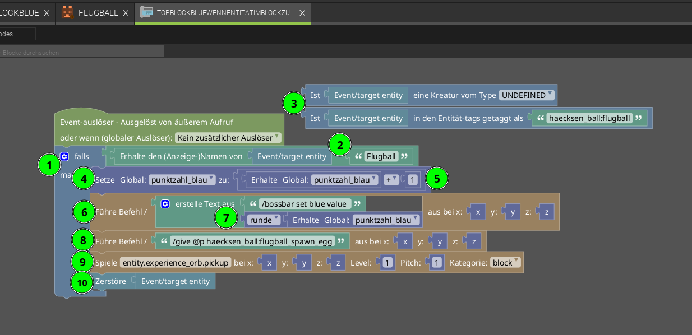

# Level 3: Tore / Punkte zählen

So, wir haben Tore, einen Ball - aber aktuell werden die Tore noch nicht gezählt. Das packen wir in diesem Level an!

{}

Was genau ist eine Variable? Variable hört sich an wie „variabel“, also veränderbar. Am besten kannst du dir eine Variable wie einen dieser Klebezettel vorstellen. Die sind super, um sich Sachen zu merken!

**Hintergrund: Variablen-Typen**

Es gibt verschiedene Arten von Variablen, je nachdem, was du ausdrücken möchtest:

- Ja / Nein – Boolean
- Text – String
- Einfache Zahlen (1, 2, 3...) – Integer
- Kommazahlen (3,1415) – Float

Und noch viele andere...

**Achtung: Gute Namen sind gute Helfer**

Variablennamen können aus einem einzelnen Buchstaben oder aus ganzen Wörtern bestehen. Wähle also weise: Gib den Variablen Namen, die andere (und auch du nach 2 Wochen) noch verstehen. Dann findest du dich viel leichter im eigenen Programm zurecht.

{} 

## Punkte merken

Wir erstellen also eine Variable - In dieser merken wir uns jeweils die Tore / Punkte pro Team.

Dazu erstellen wir eine Variable für jedes Team:

1. Wähle in der seitlichen Leiste *Variablen* aus.
2. Füge eine *Neue Variable hinzu*.
3. Vergib einen *Variablennamen* und setze den *Variablentyp* auf *number*.
4. Speichere mit *Ok*.

## Tore erkennen

Jetzt müssen wir nur noch erkennen, wenn ein Tor geschossen wurde. Genau - da gab's ja was - die "Auslöser". Wir suchen also einen Auslöser, der erkennt, wenn ein Tor geschossen wurde.

  

Wir fügen 2 Auslöser hinzu:

- Einen *Wenn Block rechts geklickt wird*,  
  um Punkte zurückzusetzen.
- Einen *Wenn Entität im Block zusammenstößt*,  
  um Punkte hochzuzählen und den Ball zu entfernen.

### Prozedur 1: Punkte zurücksetzen 

In diesem Fall möchten wir, dass die Punkte des Teams auf "0" gesetzt werden und dass die Bossbar auch zurückgesetzt wird. Dafür verwenden wir folgende Befehle:

1. Setzt die globale Variable zum Punkte Zählen auf 0 zurück.
2. Führt `/bossbar set blue value 0` in Minecraft aus, um die Bossbar wieder auf 0 zu setzen.

### Prozedur 2: Tore zählen  

Um die Tore zu zählen, haben wir einen Auslöser erstellt, der immer startet, wenn er vom Ball berührt wird.

Die Prozedur für den Zusammenstoß mit einer Entity ist länger und sieht so aus:

1. Tore sollen nur bei Ball-Kontakt gezählt werden: Als erstes prüft das Programm, ob es sich bei der Entität um einen Ball handelt.
2. Dazu "holt" es sich den Anzeigenamen der "Berührenden Entity" mit `Erhalte den Anzeigenamen von Event/target entity` und prüft, ob er mit dem String `Flugball` übereinstimmt (muss übereinstimmen mit dem Objektnamen bei [Bild und Ton von *Ball erstellen*](../02-ball-erstellen/ball-erstellen.md)).
3. Diese beiden Zeilen, die vom Hauptcodeblock abgelöst sind, werden nicht ausgeführt. Sie dienen nur als Hinweis darauf, was wir ausprobiert haben: Bei der (3) wollten wir auf diese beiden Arten testen, ob es sich um einen Ball handelt. Das hat leider nicht funktioniert.
4. Erhöhe die Punktzahl von Blau: 
    - Dazu holt es sich die aktuelle `punktzahl_blau`.
    - Addiert die Zahl *1* hinzu.
    - Speichert das Ergebnis mit `Setze Global: punktzahl_blau` erneut in der Punktezahl für Blau ab.
5. Wir führen den Minecraft Befehl für die Bossbar aus - den kennst du bereits aus Level 3.
6. Dazu kombinieren wir den Text `/bossbar set blue value ` **(Achtung! Leerzeichen am Ende sind wichtig, damit es funktioniert)** mit der `punktzahl_blau` und runden diese, da Minecraft keine Dezimalzahlen erkennt.
7. Wir geben dem Spieler, der am nächsten steht (`@p`), ein neues Spawn-Ei:  
    `/give @p alpaka_ball:flugball_spawn_egg`
8. Wenn ein Tor fällt, muss man das natürlich auch hören: Mit diesem Befehl können wir einen Ton abspielen lassen, wenn ein Tor geschossen wurde. Hier z.B. der gleiche Ton, den man hört, wenn man XP aufsammelt: *entity.experience_orb.pickup*.
9. Am Schluss wollen wir den Ball "los werden" - er soll verschwinden und mit einem neuen Ball geht es weiter.  
    - Dazu verwenden wir am besten den Befehl `Zerstöre`.
    - Achte darauf, dass die Minecraft-Befehle `kill @e[...]`, `tp @e[...] ~ -500 ~` und MCreator `Lösche` nicht funktionieren.
10. **Vergiss nicht zu speichern ;)**

{}
Vielleicht wunderst du dich, warum wir dem blauen Team einen Punkt geben, wenn ein Ball ins blaue Tor geht - müsste es nicht andersherum sein? Aber sobald mehr als zwei Teams mitspielen, würde es nicht mehr funktionieren. Mit 12 Punkten hat man also verloren.
{} 

{}  
Wenn ihr möchtet, könnt ihr am Anfang auch 12 Punkte vergeben und mit jedem Tor im blauen Torblock 1 Punkt von Blau abziehen. Experimentiert gerne mit den Zahlen rum ;)  
{}  

{}  
Jetzt könnt ihr im Spiel testen. Wenn ein Ball in einen blauen Torblock fliegt, sollte ein Ton erklingen, die Punktzahl in der Bossbar erhöht werden, der Ball verschwinden und ihr erhaltet ein neues Spawn-Ei.  
{}

### Jetzt nochmal für Orange
Die Variable `punktezahl_orange` für Orange haben wir bereits erstellt. Jetzt fehlen nur noch die passenden Prozeduren, die wir vom Team Blau kopieren können.

- Geht zum **Arbeitsplatz**.
- Rechtsklickt auf die Prozedur und wählt **Mod-Element duplizieren**.
- Benennt die neuen Prozeduren um, z.B. ...Orange... statt ...Blau...

Jetzt müsst ihr natürlich alle Stellen, an denen "Blau" steht, durch "Orange" ersetzen, sowohl in den beiden Codedateien als auch im Auslöser:

Vergesst nicht, auch den Auslöser anzupassen!

{}  
Testet alles noch einmal ;)

Wenn etwas nicht funktioniert, geht die Schritte oben Schritt für Schritt durch, um sicherzustellen, dass nichts vergessen wurde.

{}
