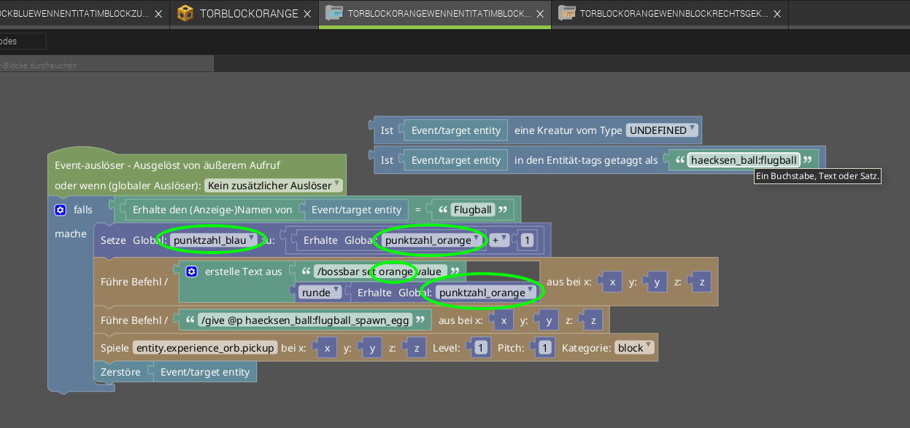

# Punkte Zählen
Als erstes müssen wir uns die Punktzahl für jedes Team merken:

das machen wir für beide team farben.

jetzt müssen wir beim Torblock neue Auslöser hinzufügen:

- einen *Wenn Entität im Block zusammenstößt*  
  um Punkte hoch zu zählen und Ball zu entfernen
- einen *Wenn Block rechts geklickt wird*  
  um Punkte zurück zu setzen.

Die Prozedur für den Rechtsklick sieht so aus:

1. Setzt die globale variable zum Punkte Zählen auf 0 zurück
2. führt `/bossbar set blue value 0` in Minecraft aus um die Bossbar wieder auf 0 zu setzen.

Die Prozedur für den Zusammenstoß mit einem Entity ist länger und sieht so aus:

1. Weil wir nur wollen, dass ein Punkt nur dann verteilt wird, wenn der Ball das Tor berührt checken wir bei ob es sich bei der Entität um einen Ball handelt
2. dazu erhalten wir den Anzeige-Namen und prüfen ob der gleich *Flugball* (muss übereinstimmen, wie der Objektname bei [Bild und Ton von *Ball erstellen*](../02-ball-erstellen/ball-erstellen.md))
3. die vom Hauptcodeblock abgelösten Anweisungen werden nicht ausgeführt und dienen nur als Hinweis was ich probiert hab: bei der (3) wollt ich auf diese 2 Wege testen ob es sich um einen Ball handelt, was leider nicht geklappt hat.
4. Erhöht die Punktzahl von Blau:
5.  - dazu holt es sich die aktuelle *punktzahl_blau* 
    - und fügt mit *+* 
    - die Zahl *1* hinzu 
    - und Speichert das ergebnis mit *Setze Global: punktzahl zu* wieder in der Punktezahl für blau ab.
6. Wir führen den Minecraft Befehl für die Bossbar aus
7. dazu kombinieren wir den text `/bossbar set blue value ` (!Achtung! Leerzeichen am Ende wichtig, dass es funktioniert) mit der *punktzahl_blau* und runden diese, weil es sich sonst um eine Kommazahl handelt. (zwar immer ,0 aber Minecraft kennt hier keine Kommazahl, desshalb machen wir die so weg)
8. wir geben dem nächsten Spieler (`@p`) ein neues Spawn-Ei  
  `/give @p haecksen_ball:flugball_spawn_egg`
9. mit diesem Befehl können wir einen Ton abspielen lassen, wenn ein Tor geschossen wurde. Hier z.B. der gleiche Ton, wenn man XP aufsammelt: *entity.experience_orb.pickup*
10. am Schluss wollen wir den Ball natürlich los werden:  
    - dazu am besten den Befehl *Zerstöre* verwenden
    - Achtung: die Minecraft befehle `kill @e[...]`, `tp @e[...] ~ -500 ~` und MCreator `Lösche` gehen nicht aus verschiedenen Gründen.
11. Speichern nicht vergessen ;)

Ich hab absichtlich dem Blauen Team ein Punkt gegeben, vtl ein Negativ-Punkt, damit man sehr einfach um ein weiteres Team ergänzen kann.

Jetzt kanns im Spiel getestet werden, und wenn ein Ball in einen blauen Torblock fliegt, dann sollte ein Ton kommen, die Punktzahl in der Bossbar erhöht werden, der Ball verschwinden und man bekommt ein neues Spawn-Ei.

## jetzt nochmal für Orange
Die Variable `punktezahl_orange` für Orange haben wir ja schon erstellt.
jetzt noch die Prozeduren kopieren:

Jetzt natürlich noch alle dinge von Blau zu Orange ändern in den beiden Codedateien:

Und nicht vergessen!!:

und nochmal testen ;)