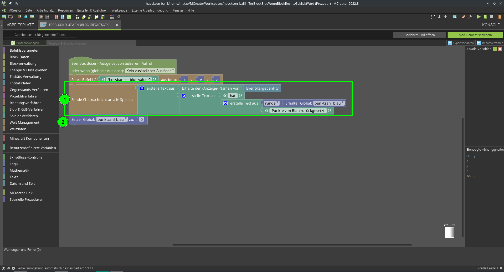

# Level 4: Erweiterte Punkte-Anzeige / Punkte zurücksetzen

Beim testen und spielen, ist uns etwas aufgefallen: Jeder kann ja relativ einfach dem anderen Team Punkte klauen - einfach zum Tor schleifen und rechts klicken. Da haben wir uns folgendes überlegt: wenn es jedes mal eine Nachricht an alle Spieler gibt, wenn Punkte zurückgesetzt werden, wäre der Mogler schnell enttarnt!  Schau Dir mal folgenden Programm-Code an:

1. Wir setzen aus vielen Bauteilen die Nachricht für den Chat zusammen  
    - Spielername mit *Erhalte den (Anzeige-)Name von > Event/target entity*
    - " hat " (Leerzeichen nicht vergessen)
    - *runde* ]> *Erhalte Global punktzahl_blau*
    - " Punkte von Blau zurückgesetzt!"
2. Aufpassen, dass die Punkte erst danach auf 0 gesetzt werden, ansonsten wird im Chat immer 0 angezeigt.

Das gleiche natürlich auch noch in dem Code für Orange, damit es für beide Farben passt.

  
Wenn wir mehrere Textbausteine aneinander hängen, müssen wir drauf achten wo die Leerzeichen stehen, sonst wird der Text schwer lesbar ;)
z.B. vor und nach *hat* ist jeweils ein Leerzeichen.  


  
Starte Dein Programm und teste alles noch mal durch! Geht alles?  
Für beide Farben?  

