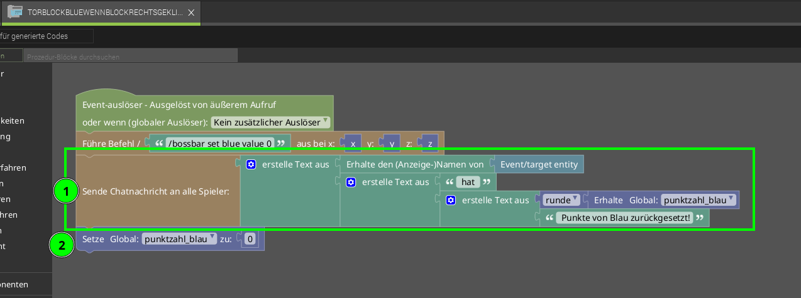

# Level 4: Erweiterte Punkte-Anzeige / Punkte zurücksetzen

Beim Testen und Spielen ist uns etwas aufgefallen: Jeder kann relativ einfach dem anderen Team Punkte klauen, indem er einfach zum Tor schleicht und rechts klickt. Deswegen haben wir uns Folgendes überlegt: Wenn jedes Mal eine Nachricht an alle Spieler gesendet wird, wenn Punkte zurückgesetzt werden, wäre der Betrug schnell enttarnt. Schau dir mal den folgenden Programm-Code an:

1. Wir setzen aus vielen Bauteilen die Nachricht für den Chat zusammen:
    - Spielername mit *Erhalte den (Anzeige-)Namen von > Event/target entity*
    - " hat " (Leerzeichen nicht vergessen)
    - *runde* ]> *Erhalte Global punktzahl_blau*
    - " Punkte von Blau zurückgesetzt!"
2. Achte darauf, dass die Punkte erst danach auf 0 gesetzt werden, ansonsten wird im Chat immer 0 angezeigt.

Das Gleiche musst du auch in dem Code für Orange durchführen, damit es für beide Farben passt.

{}
Wenn wir mehrere Textbausteine aneinander hängen, müssen wir darauf achten, wo die Leerzeichen stehen, sonst wird der Text schwer lesbar. Zum Beispiel vor und nach *hat* ist jeweils ein Leerzeichen.
{}

{}
Starte dein Programm und teste alles noch einmal! Funktioniert alles? Für beide Farben?
{}
