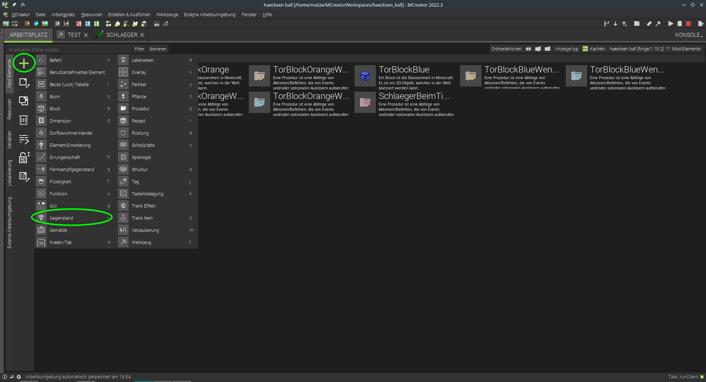
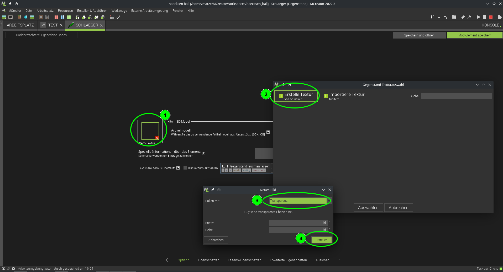
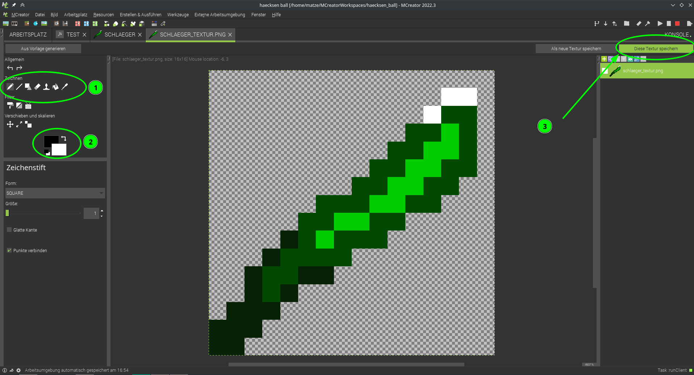
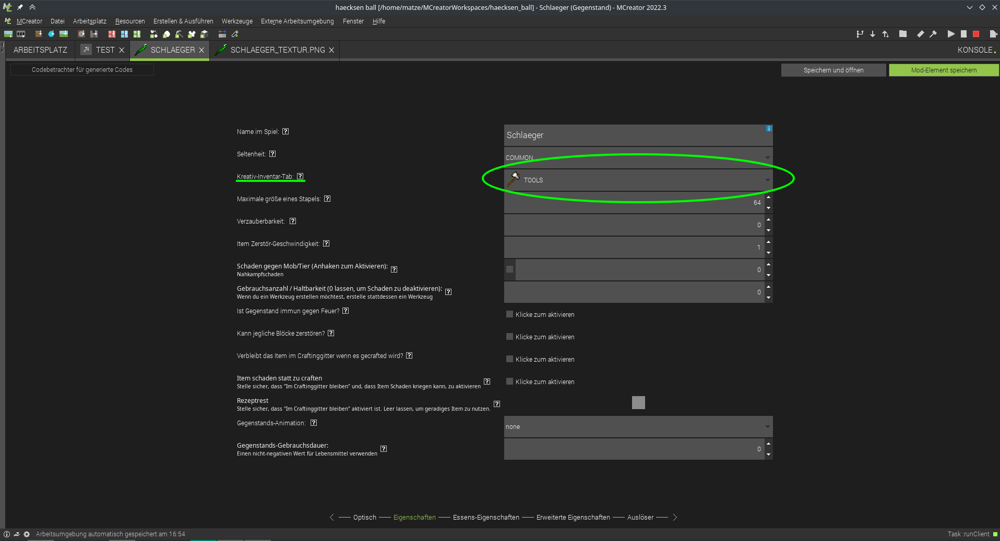
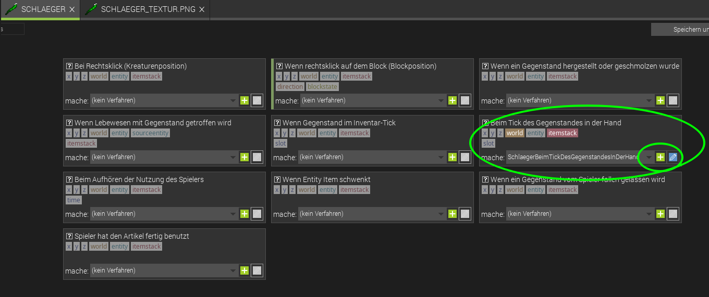
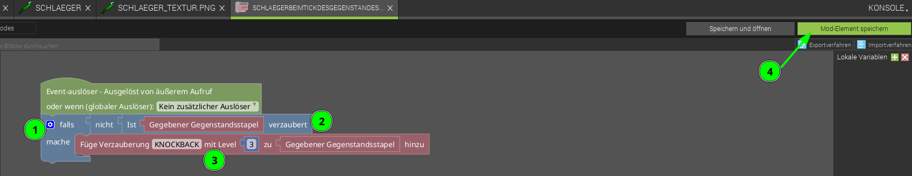
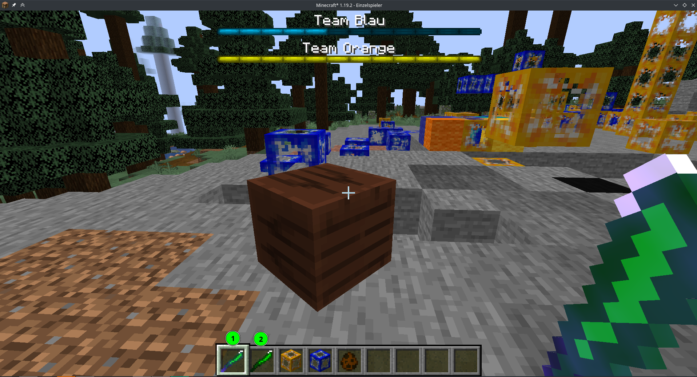

# Level 5: Die Haecksenball-Schläger
Wie beim Eishockey, Golf und Tennis macht das Spiel mehr spaß mit einem richtigen Schläger für den Ball ;)

Wir fügen ein Gegenstand hinzu:

Name vergeben z.B. Schlaeger

  

1. Zeichentool auswählen
2. Farbe auswählen
3. Speichern, Als **Gegenstandtextur**!  
   Dann beim Gegenstand die gerade erstellte Textur nochmal auswählen.

Als Inventar Tab hab ich *Tools* ausgewählt, dass es bei den anderen Werkzeugen auftaucht im Inventar.

Weils hier keine Einstellung dafür gibt wie viel Rückstoß der Schläger haben soll machen wir dafür wieder eine Prozedur die immer ausgeführt wird wenn der Schläger in der Hand gehalten wird:

Der code, dass der Schläger automatisch verzaubert wird:  

1. Testen ob der Gegenstand noch nicht verzaubert ist.
2. Dazu verneinen wir die Antowrt auf die Frage *Ist Gegebener Gegenstandsstapel verzaubert*
3. und dann fügen wir die Verzauberung *KNOCKBACK* auf deutsch Rückstoß mit dem level *3* hinzu.

Kleiner Test im Spiel:

Schläger in der Hand wird sofort verzaubert :D 

## Kleiner Tipp
man kann auch mit einem Bogen (vtl mit Schlag verzaubert) sehr gut Spielen wenn der Ball weiter weg ist ;)
