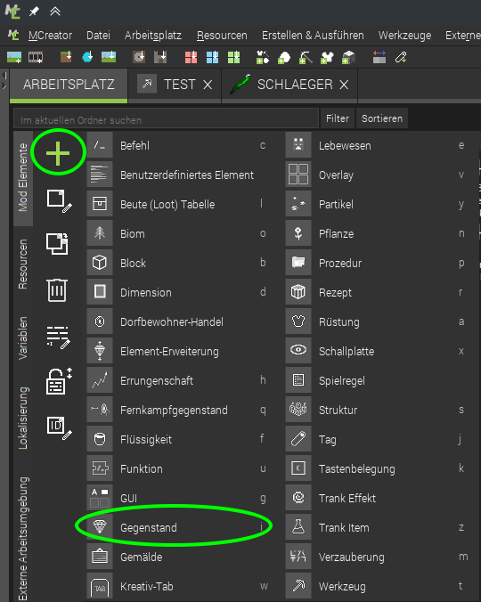

# Level 5: Die Haecksenball-Schläger

Stell Dir vor, Du spielst Eishockey, Golf oder Tennis - ohne Schläger. Hört sich komisch an, oder? Also brauchen wir noch den passenden Schläger: da macht das Spiel noch mehr Spaß! 💪

## Erstelle einen neuen **Gegenstand**

- Wechsle zum Arbeitsplatz
- "+" klicken und "Gegenstand" auswählen

Der neue Gegenstand braucht natürlich einen Namen - "Schlaeger" zum Beispiel. 



Probier mal den Schläger auch so zu nennen mit Ä statt AE. Wenn Du den Gegenstand angelegt hast, fällt Dir vielleicht auf, dass er dann in MCreator "Schlager" heißt. Schlager? Komisch!

Das liegt daran, das Computer an ganz vielen Stellen noch nicht wirklich mit Umlauten und erweiterten Zeichen wie Emoticons oder anderen Schriftarten umgehen können. Darum macht MCreator automatisch aus dem **Ä** ein **A**. Darum haben wir uns gleich für den Namen Schl**ae**ger mit entschieden. 

 

### Textur für den Schläger pixeln

  

1. Zeichentool auswählen
2. Farbe auswählen
3. Speichern, Als **Gegenstandtextur**!  
   Dann beim Gegenstand die gerade erstellte Textur nochmal auswählen.

### Eigenschaften des Schlägers

Jetzt müssen wir noch ein paar Sachen festlegen, damit auch alles so ist, wie wir das für einen Schläger erwarten. Wechsel dazu zu den *Eigenschaften*.

Als Inventar Tab hab ich *Tools* ausgewählt, dass es bei den anderen Werkzeugen auftaucht im Inventar.

### Rücktstoß

Der Schläger soll natürlich jetzt besondere Eigenschaften haben, wie eich echter Sport-Schläger. Weil es aber in der normalen Eigenschaften keine Einstellung dafür gibt, wie viel Rückstoß der Schläger haben soll, behelfen wir uns anders. 

Genau - die Auslöser kann man ja nutzen, um auf Sachen im Spiel zu reagieren. Du nutzt jetzt einen neuen Auslöser - der immer läuft, wenn man ihn in der Hand hält: 

Um den Rückschlag zu erstellen, "verzaubern" wir den Schläger einfach. Der Auslöser läuft ja "immer", solange ein Spieler den Schläger in der Hand hat, darum musst Du etwas mehr programmieren:

1. Testen ob der Gegenstand noch nicht verzaubert ist - sonst würde er ja jeden Tick neu verzaubert
2. Dazu "verneinen" wir die Antwort auf die Frage *Ist Gegebener Gegenstandsstapel verzaubert*. Das bedeutet, mit dem Befehl `nicht` drehen wir das Ergebnis von `ist ... verzaubert` um, und erhalten `wahr`, wenn er nicht verzaubert ist.
3. und dann fügen wir die Verzauberung `KNOCKBACK` auf deutsch "Rückstoß" mit dem `Level *3*` hinzu.



Probiere es gleich aus! Klappt es? Dann müsste sich der Gegenstand sofort verzaubern, wenn Du ihn in die Hand nimmst. Das sieht Du in dem Spiel - der Schläger auf Slot 1 ist verzaubert (blau...), der in Slot 2 nicht. 

 


Man kann auch mit einem Bogen (vtl mit Schlag verzaubert) sehr gut Spielen wenn der Ball weiter weg ist 

Probiere es doch mal aus! 🧪
 

## 
