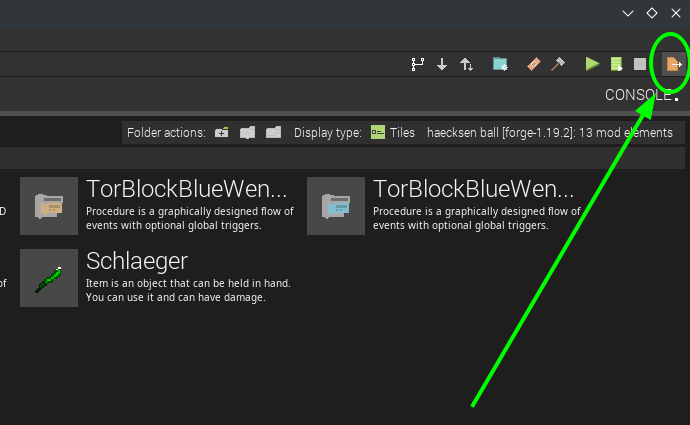
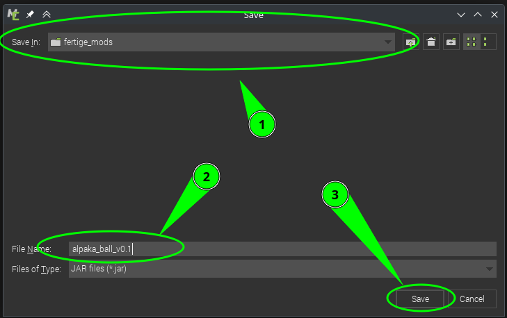

# Level 7: Exportieren & Installieren der Mod

So alles fertig - jetzt wird es Zeit, die Mod zu exportieren und zu veröffentlichen, damit auch deine Freunde die Mod herunterladen und installieren können.

## JAR-Datei exportieren

Um die Mod in Minecraft ohne MCreator zu spielen brauchen wir eine `.jar` Datei.  
Diese können wir uns generieren lassen:  

nachdem click auf das exportieren symbol wird dier `.jar` generiert und MCreator fragt nach einem Speicherort:  

diese `.jar` Datei kann man wie jede andere mod installiert werden.  

## Mod Installieren

Am einfachsten klappt die Installation von Mods mit einem erweiterten Launcher, zum Beispiel unserem Lieblings-Launcher "[ATLauncher](https://atlauncher.com/)":

1. ATLauncher herunterladen und installieren: https://atlauncher.com/
2. Neue Minecraft Instanz erstellen:
   1. Klicke auf "Vanilla Packs"
   2. Wähle die richtige Version - 1.19.2 in unserem Fall
   3. Wähle den **"Forge"-Loader** (wichtig!)
   4. Klicke auf "Create Instance"
3. Wechsle auf den Reiter "**Instances**"
4. Klicke den Knopf "**Edit Mods**"
5. Klicke auf "**Add Mod**" und wähle die JAR Datei von oben aus



Gemeinsam auf einem Server spielen? Die einfachste Variante ist, in Minecraft von einem Rechner das Spiel freizugeben:

***\*Minecraft\** über \**LAN\**-Server spielen**

1. Starten Sie das Spiel **Minecraft** wie gewohnt.
2. Wählen Sie "Singleplayer" und starten Sie die gewünschte Welt, oder erstellen Sie eine neue.
3. Klicken Sie im Spiel auf die "Escape Taste" und wählen Sie anschließend "Für **LAN** öffnen".
4. Passen Sie die Einstellungen an und Klicken Sie auf "OK".

Wenn Du auf einem "öffentlichen" Server im Internet gemeinsam spielen willst, muss dieser auch mit Forge laufen und auch die Mod installiert haben. 

 