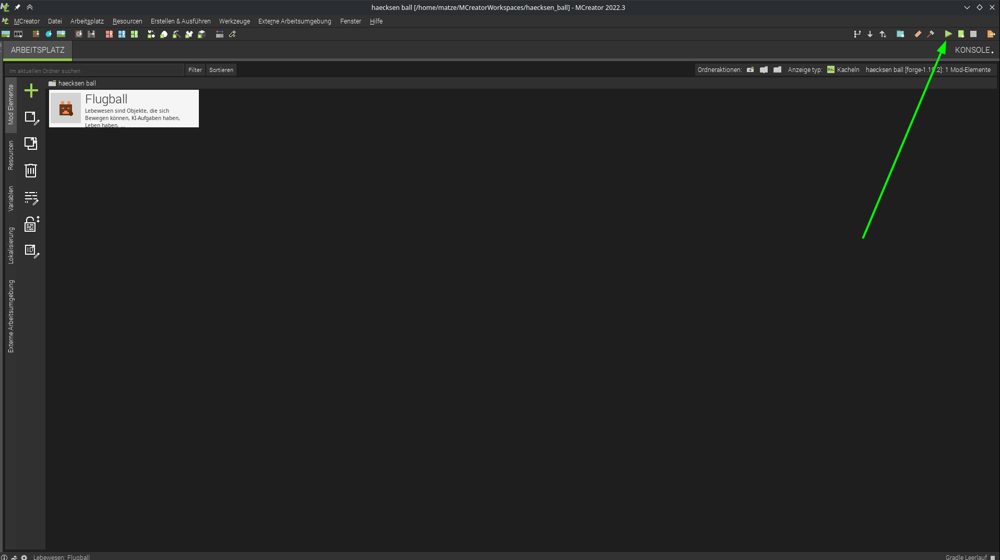

# Ball erstellen

wichtig bei bild und ton:

1. name wird übernommen aus vorigem dialog
2. textur muss hinzugefügt werden mit dem plus  
als textur kann z.B. diese hier verwendet werden  
  
muss bei dem Textur-Auswahl-Dialog importiert werden 
TODO?: genauer erklären?
3. erst danach kann man die textur im dropdown auswählen
4. wir lassen uns auch ein spawn-ei generieren
5. für das ei können wir bei den 3 punkten die farben auswählen
6. zu jedem attribut das man hier auswählen kann gibt es bei dem fragezeichen einen Hilfetext
7. Speichern nicht vergessen
nach dem speichern dauerts eine kleine weile, bis MCreator die mod daraus erstellt hat, wenn dann das play-dreieck oben rechts grün ist kann man mit dem play-dreieck dann Minecraft direkt mit der neuen Mod starten.

wie gewohnt in minecraft eine creative welt erstellen
TODO: anleitung dafür nötig?

so bekomme ich das ei:

so siehts bis jetzt aus:

- der ball fällt und fliegt noch nicht
- der ball läuft selbst noch rum
- ball kann noch getötet werden wenn man ihn schlägt :(

so kann ein element weiter bearbeitet werden:

doppelklick!

Verhalten bearbeiten:

erst auf den verhaltens reiter unten wechseln:
dann gibts die Werte zu ändern.
- creature damit der ball nich angreift
- bewegungsgeschwindigkeit = 0, damit er uns nicht von alleine weg fliegt
- unser ball soll nicht sterben wenn man ihn schlägt
    - Gesundheitswert = 1024 (höchst möglicher wert, (2er potenz ;)) 
    - Rüstungsschutz = 100 (auch höchst möglicher wert)

so siehts bis jetzt aus:

- der ball fällt nicht mehr, sondern fliegt
- der ball läuft nicht mehr herum
- ball stirbt nicht mehr ;)
- macht jetzt schon spaß den Ball mit Schlag oder Rückstoß verzauberten Schwert und Bogen zu schlagen ;D