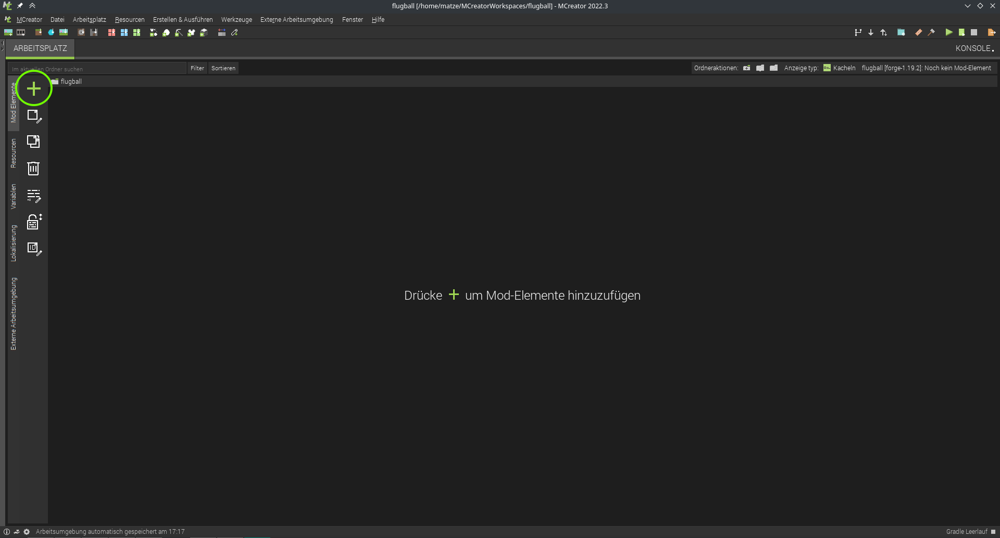
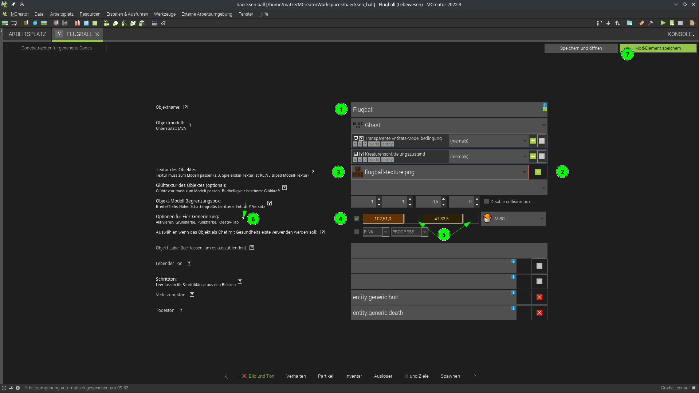
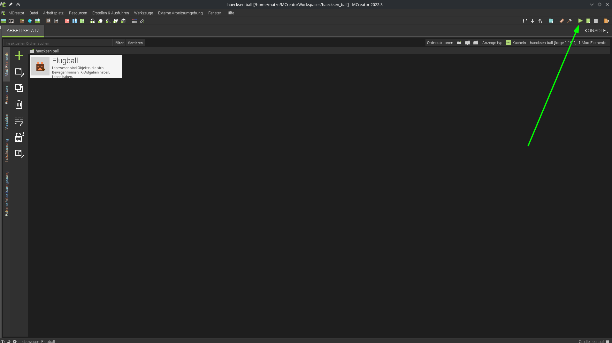
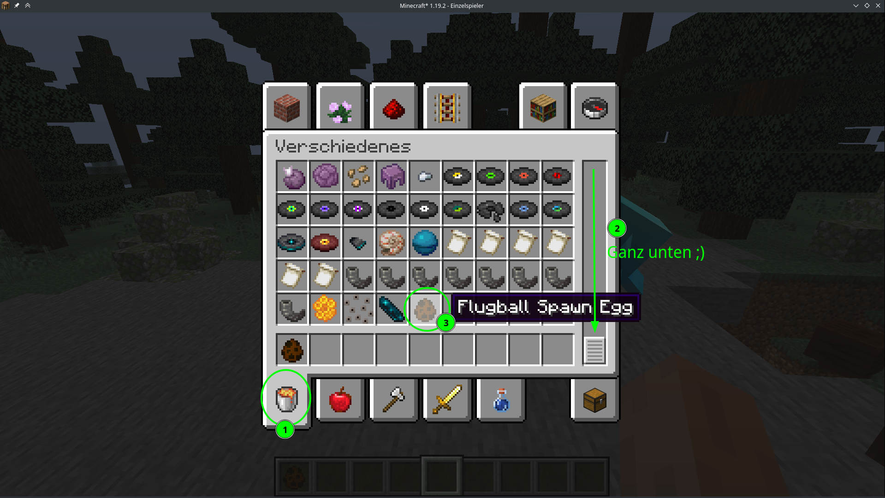
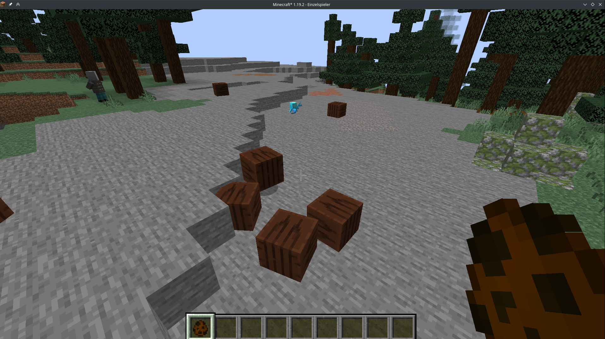

## projekt anlegen

name wählen
internetseite schließen
download und build dauert n bisschen
## erstes ding erstellen

wichtig bei bild und ton:
1. name wird übernommen aus vorigem dialog
2. textur muss hinzugefügt werden mit dem plus  

3. erst danach kann man die textur im dropdown auswählen
4. wir lassen uns auch ein spawn-ei generieren
5. für das ei können wir bei den 3 punkten die farben auswählen
6. zu jedem attribut das man hier auswählen kann gibt es bei dem fragezeichen einen Hilfetext
7. Speichern nicht vergessen

nach dem speichern dauerts eine kleine weile, bis MCreator die mod daraus erstellt hat, wenn dann das play-dreieck oben rechts grün ist kann man mit dem play-dreieck dann Minecraft direkt mit der neuen Mod starten.

so bekomme ich das ei:

so siehts bis jetzt aus:

- der ball fällt und fliegt noch nicht
- der ball läuft selbst noch rum
- ball kann noch getötet werden wenn man ihn schlägt :(