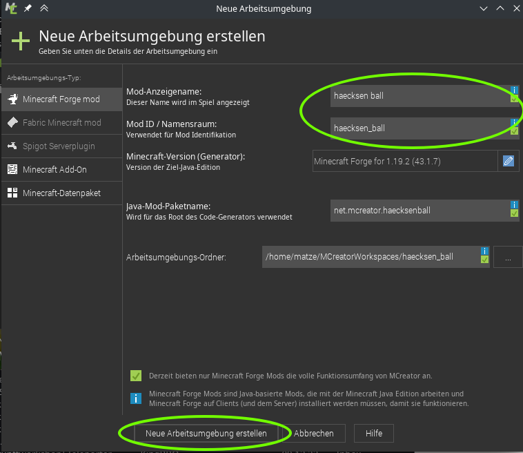

# Projekt anlegen

name wählen
internetseite schließen
download und build dauert n bisschen

TODO: übersicht ide, wo ist was
- start game
- stop game / task
- erstellte elemente 
- neues hinzufügen
- ...

über den grünen dreieck-play button kann man minecraft gleich starten mit der erstellten mod.

## nützliche ingame einstellungen
vanilla Einstellungen, also Dinge die ohne Mod auch gehen:
- Zeit auf Tag setzen und auf Tag lassen  
`/time set day` & `/gamerule doDaylightCycle false`
- Wetter auf schön setzen und wetter so lassen
`/weather clear` & `/gamerule doWeatherCycle false`