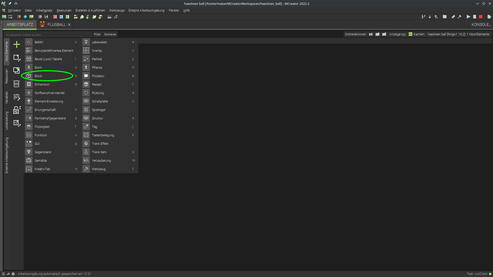
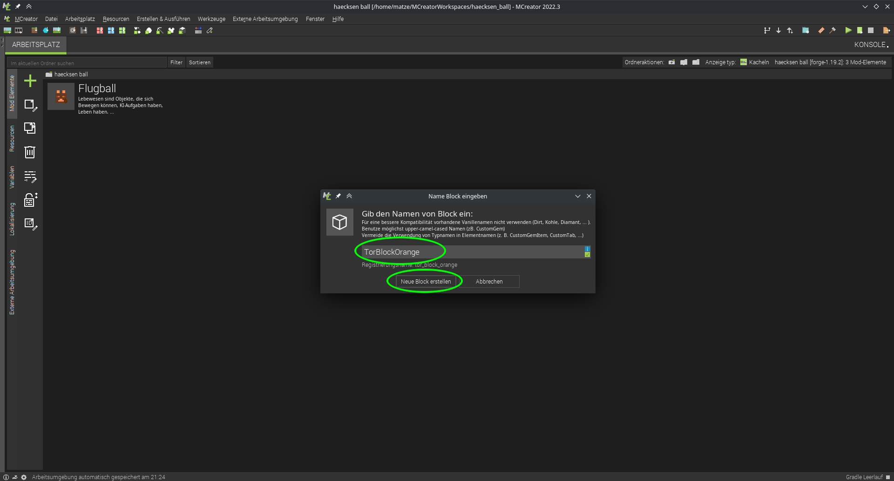
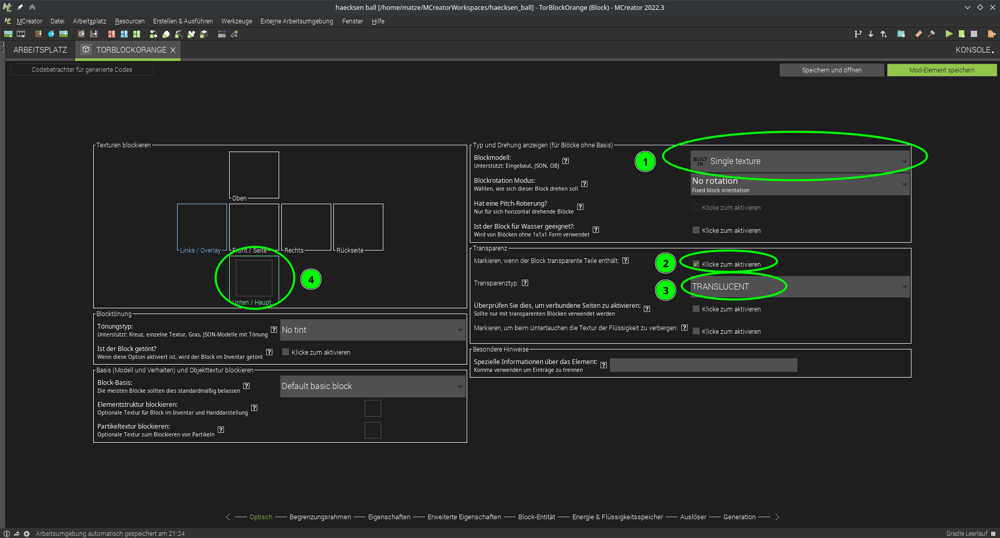
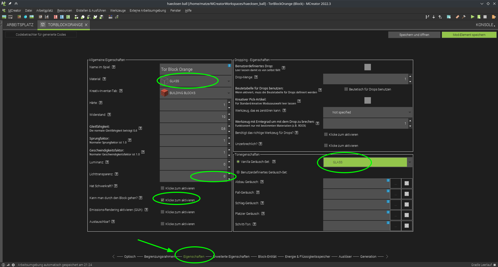

# Tor erstellen

Block Eigenschaften vergeben:

1. wählen wir aus, dass auf allen Seiten die gleiche Textur verwendet werden soll, das spart uns Arbeit ;)

die Beispieltextur (schritt 4) ist halb transparent, desshalb:

2. wählen wir hier aus, dass die der Block transparente Teile enthällt
3. und den Transparenztyp *Translucent*

als Beispieltextur für das Tor könnt ihr das verwenden:  
  

4. Hier kann die textur importiert und für den Block ausgewählt werden

als nächstes schlag ich vor wir geben dem Block glasähnliche eigenschaften:

zu dem Zeitpunkt kannst du dir gerne mal anschauen wies aktuell in Minecraft aussieht