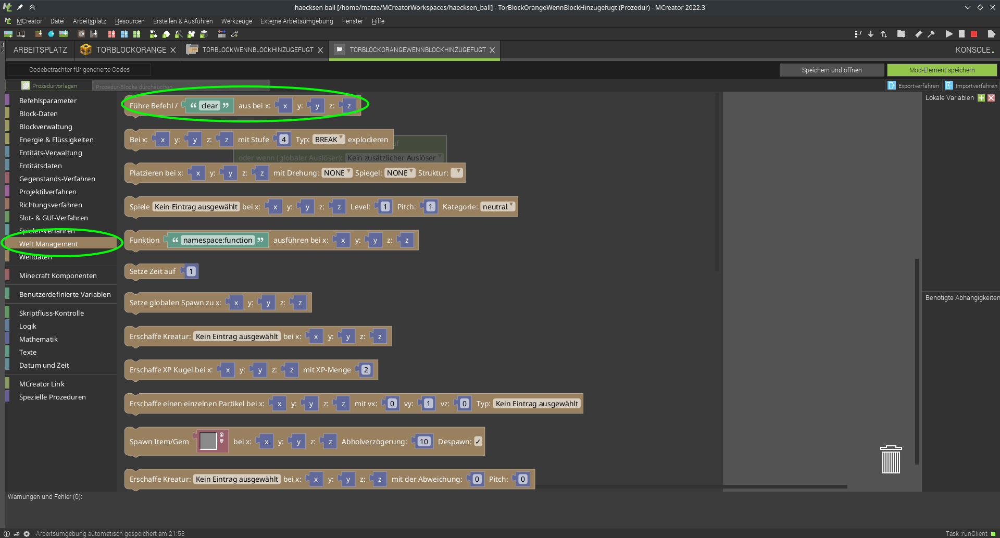
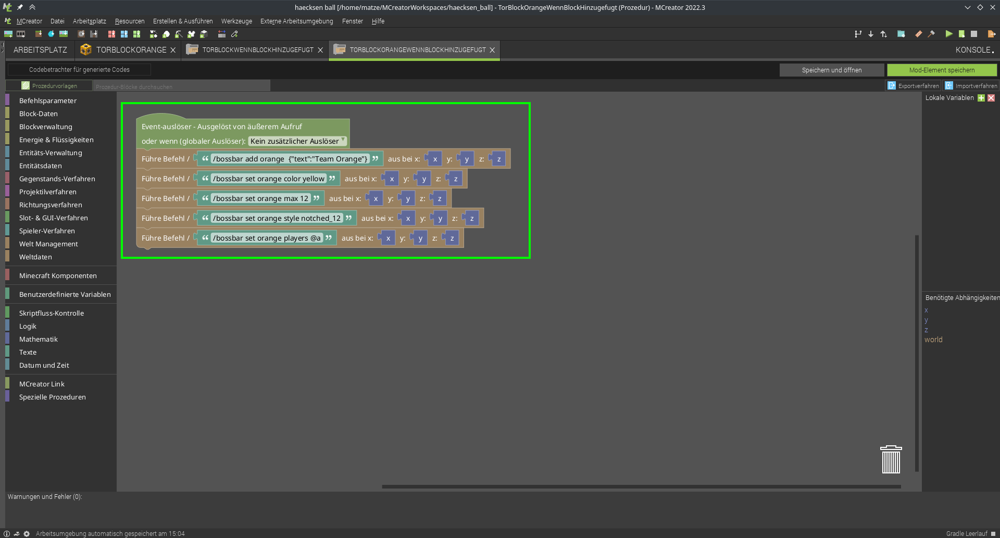
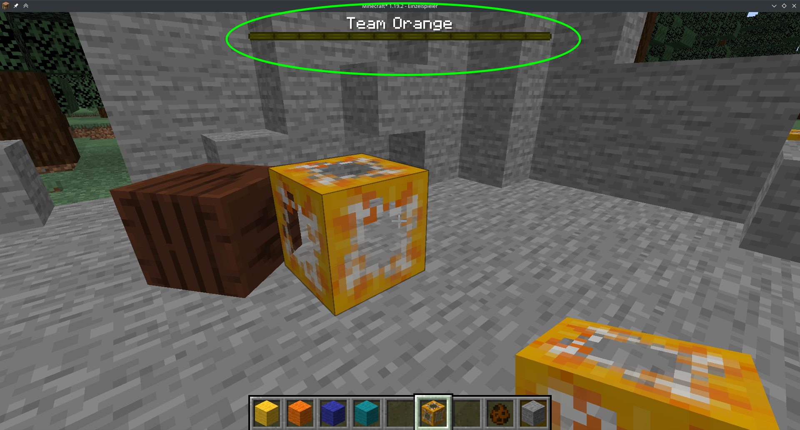

# Tor erstellen


Block Eigenschaften vergeben:

1. wählen wir aus, dass auf allen Seiten die gleiche Textur verwendet werden soll, das spart uns Arbeit ;)

die Beispieltextur (schritt 4) ist halb transparent, desshalb:

2. wählen wir hier aus, dass die der Block transparente Teile enthällt
3. und den Transparenztyp *Translucent*

als Beispieltextur für das Tor könnt ihr das verwenden:  
  

4. Hier kann die textur importiert und für den Block ausgewählt werden


als nächstes schlag ich vor wir geben dem Block glasähnliche eigenschaften:


zu dem Zeitpunkt kannst du dir gerne mal anschauen wies aktuell in Minecraft aussieht

jetzt wollen wir natürlich noch eine anzeige für die tore hinzufügen:  
Die Minecraft Vanilla (also ohne Mods) Befehle, die eine Bossbar hinzufügen
```mcfunction
# bossbar erstellen
/bossbar add orange  {"text":"Team Orange"}
# farbe festlegen
/bossbar set orange color yellow
# Maximalwert festlegen
/bossbar set orange max 12
# Stiel auswählen (schön, passend zum Max-wert)
/bossbar set orange style notched_12
# dann für alle sichtbar machen
/bossbar set orange players @a
```


wieder namen vergeben, automatisch generierter Name passt.


- Links in den Kategorien bei *Welt Management* 
- ganz oben *Führe Befehl ... aus ..."
- hier setzen wir jetzt die ganzen Befehle von oben ein

So sieht das dann aus wenn die Befehle von oben alle ausgeführt werden sollen:

speichern nicht vergessen ;)

und gerne mal testen. Falls es schon mal getestet wurde kann man die Bossbar mit `/bossbar remove orange` wieder entfernen vor dem neuen test.

jetzt sollte es so aussehen nachdem man einen orangenen Torblock gesetzt hat:
